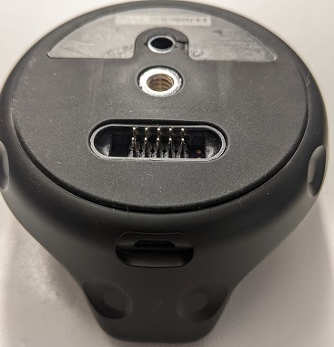

# ViveTrackerInterfaceBoard

Custom replacement interface board for the Vive Tracker 2.0.  This allows power, USB 2.0 data, and discrete I/O to be used through a single 2x5 pin 0.1" header for easier prototyping.

# Bill of materials

| Vendor          | Part Number     | Description                            | Link                                                                |
| --------------- | --------------- | -------------------------------------- |-------------------------------------------------------------------- |
| 3M              | M3AAA-1006J     | 2x5 position IDC cable, 6 inches       | https://www.digikey.com/en/products/detail/3m/M3AAA-1006J/229950    |
| Molex           | 5034801600      | 16 position FPC connector, 0.5mm pitch | https://www.digikey.com/en/products/detail/molex/5034801600/2356646 |
| TE Connectivity | 1932788-1       | USB micro B connector, reverse mounted | https://www.digikey.com/en/products/detail/te-connectivity-amp-connectors/1932788-1/4731822?s=N4IgTCBcDaIIwE4DMYDsAOdBaOIC6AvkA
| Samsung         | CL31B105KBHNFNE | Capacitor, 1206, 1uF                   | https://www.digikey.com/en/products/detail/samsung-electro-mechanics/CL31B105KBHNFNE/3891177
| Sullins         | PRPC040SAAN-RC  | Header pins 0.1"                       | https://www.digikey.com/en/products/detail/sullins-connector-solutions/PRPC040SAAN-RC/2775214 |

# Tools for installation

Torx T4 bit\
Guitar pick or similar to release clips on top shell\
Electrical tape

# Installation steps after board is assembled

Turn the tracker over and peel away the rubber cover; set aside.  This will reveal three T4 screws to be removed.\

Run guitar pick around the seam between the top and bottom shells until all clips are released.  After top shell is removed, another T4 screw will be revealed.  Remove it.\

