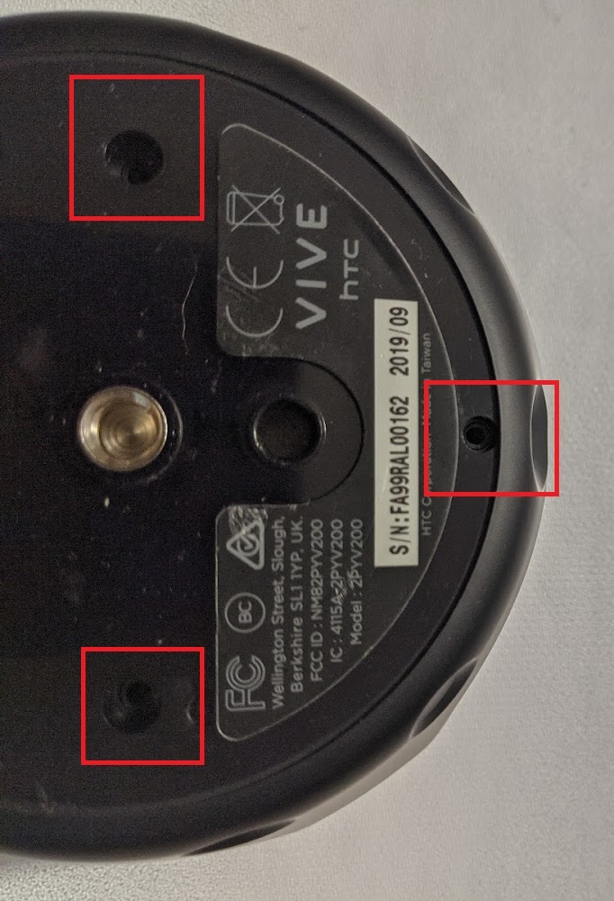
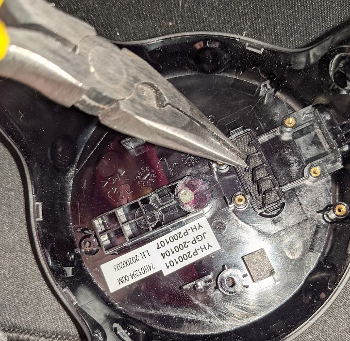
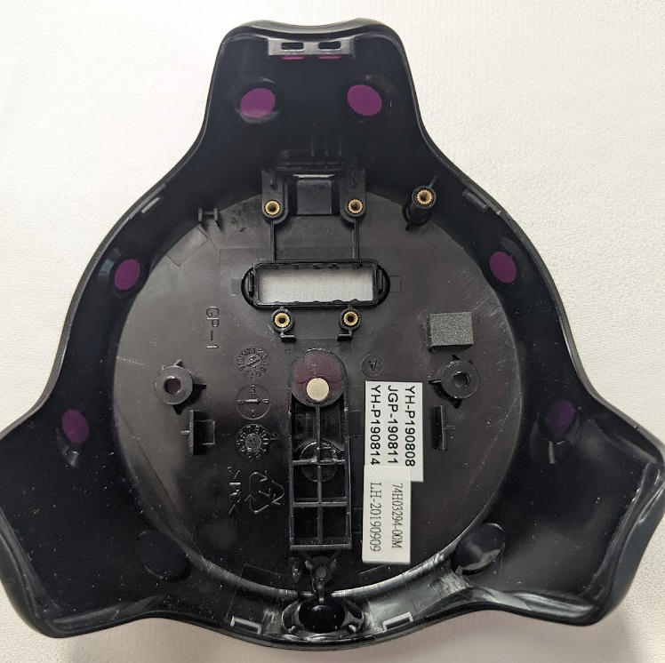
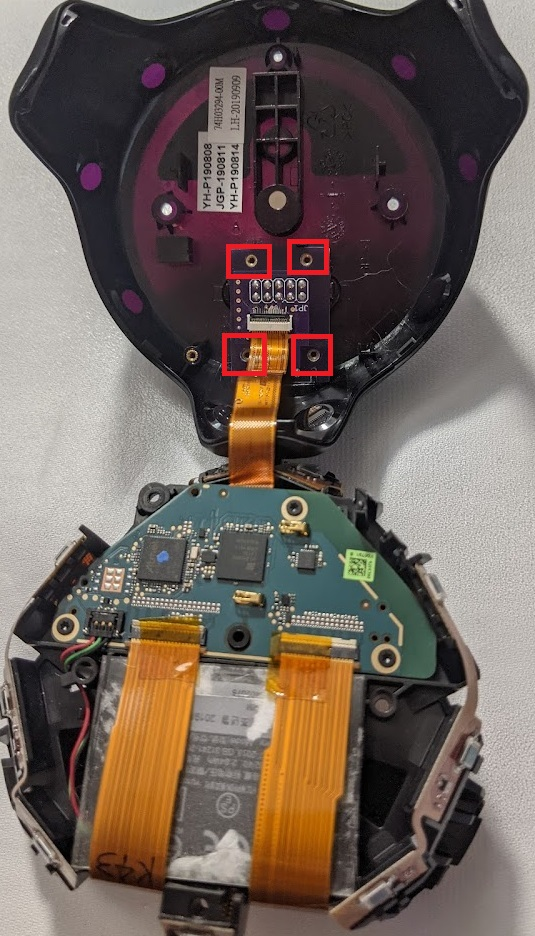
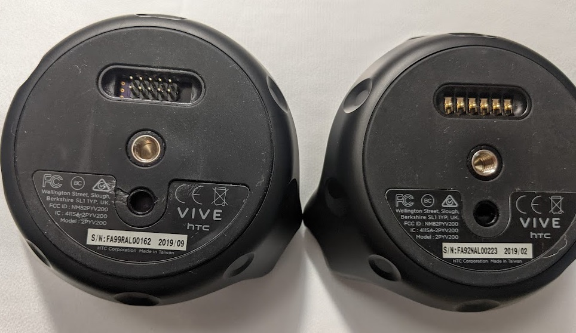

# ViveTrackerInterfaceBoard

Custom replacement interface board for the Vive Tracker 2.0.  This allows power, USB 2.0 data, and discrete I/O to be used through a single 2x5 pin 0.1" header for easier prototyping.

# Bill of materials

| Vendor          | Part Number     | Description                            | Link                                                                |
| --------------- | --------------- | -------------------------------------- |-------------------------------------------------------------------- |
| Any             | Interface Board | Recommend OSH Park 2oz-0.8mm PCB       | https://oshpark.com/                                                |
| 3M              | M3AAA-1006J     | 2x5 position IDC cable, 6 inches       | https://www.digikey.com/en/products/detail/3m/M3AAA-1006J/229950    |
| Molex           | 5034801600      | 16 position FPC connector, 0.5mm pitch | https://www.digikey.com/en/products/detail/molex/5034801600/2356646 |
| TE Connectivity | 1932788-1       | USB micro B connector, reverse mounted | https://www.digikey.com/en/products/detail/te-connectivity-amp-connectors/1932788-1/4731822?s=N4IgTCBcDaIIwE4DMYDsAOdBaOIC6AvkA
| Samsung         | CL31B105KBHNFNE | Capacitor, 1206, 1uF                   | https://www.digikey.com/en/products/detail/samsung-electro-mechanics/CL31B105KBHNFNE/3891177
| Sullins         | PRPC040SAAN-RC  | Header pins 0.1"                       | https://www.digikey.com/en/products/detail/sullins-connector-solutions/PRPC040SAAN-RC/2775214 |

# Tools for installation

Torx T4 bit\
Guitar pick or similar to release clips on top shell\
Needle-nose pliers
Electrical tape

# Installation steps

First ensure that new interface board is assembled.  Note that header pins should be trimmed flush with the board.

Turn the tracker over and peel away the rubber cover; set aside.  This will reveal three T4 screws to be removed.

Run guitar pick around the seam between the top and bottom shells until all clips are released.  After top shell is removed, another T4 screw will be revealed.  Remove it.

Carefully lift the electronics up from the bottom shell; avoid stressing the flexible printed circuit (FPC) that will still be attached to the interface board in the bottom shell.  Lift the release latch on the FPC connector and remove the FPC to free the electronics module.  The bottom shell may have tape over the corners of the interface board; remove this to reveal four more T4 screws to remove.  Finally, remove the interface board from the bottom shell.

Using needle-nose pliers, snap out the plastic dividers.  If necessary, sand the edges to make enough clearance for pin headers to pass through.

Connector new board to the FPC, then mount into the bottom shell.  After replacing all four T4 screws, put electrical tape over the screw heads.  Carefully lower electronics back into the bottom shell; feed the excess FPC back into the electronics module so that it doesn't get folder under.  Replace T4 screw on the top side.  Replace top shell.  Replace three T4 screws on the bottom side, and then finally replace the rubber cover.

Comparison after (left) and before (right):

